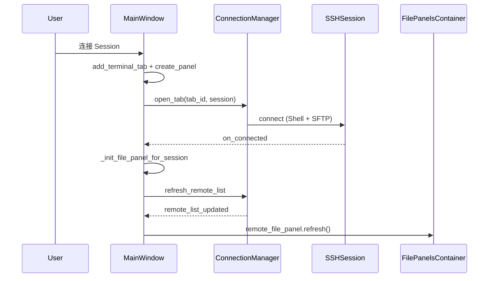
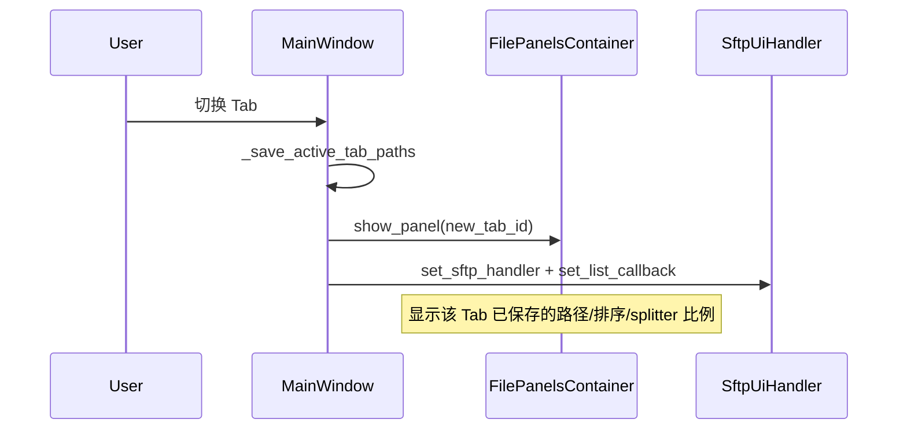

# MyPyShell 实现文档

本文档描述 MyPyShell 当前代码的架构、数据流与实现细节，供开发者阅读与维护参考。

与 [`AGENTS.md`](AGENTS.md) 的分工：

| 文档 | 面向读者 | 内容侧重 |
|------|----------|----------|
| **AGENTS.md** | AI 代理 / 协作者 | 改动边界、约定、检查清单 |
| **IMPLEMENTATION.md**（本文） | 开发者 | 模块职责、运行时行为、数据流、配置结构 |

---

## 1. 项目概述

**MyPyShell** 是一款本地桌面 **PyQt5 SSH 客户端**，功能类似 WindTerm：

- 左侧 Session 树（分组 + 连接配置）
- 右侧多 Tab 终端（VT100 仿真）
- 底部双栏文件面板（本地目录 + 远程 SFTP）
- 无边框窗口、三套主题（solarized / light / dark）、中英文界面

**技术栈：** PyQt5 · asyncssh · qasync · pyte · cryptography（Fernet 密码加密）

**参考项目：**

- UI / 主题 / i18n：[`http-requester`](../http-requester)
- 终端 VT 控件：[`nebula-shell`](../nebula-shell)（已移植为 PyQt5）

---

## 2. 依赖与运行环境

```
PyQt5>=5.15
asyncssh>=2.14
pyte>=0.8
qasync>=0.27
cryptography>=42.0
```

- **Python：** 3.10+
- **平台：** 主要面向 Windows（字体默认值含 Microsoft YaHei UI / Consolas）
- **启动：**

```powershell
cd d:\Codes\Python\MyPyShell
pip install -r requirements.txt
python main.py
```

---

## 3. 启动流程

```
main.py
  ├─ init_app_config()          # 加载 config/config.json
  ├─ QApplication + Fusion 样式
  ├─ install_*_translations()   # 对话框 / 右键菜单 i18n
  ├─ init_i18n(language)
  ├─ qasync.QEventLoop(app)     # asyncio 与 Qt 事件循环合并
  ├─ apply_app_font / apply_app_theme
  └─ MainWindow.show()
```

工作目录规则（`main.py`）：

- 打包 exe：以 exe 所在目录为根
- 源码运行：以 `main.py` 所在目录为根

所有配置文件位于 `<APP_DIR>/config/`。

---

## 4. 目录结构与模块职责

```
MyPyShell/
├── main.py                      # 应用入口
├── app_info.py                  # APP_NAME / APP_VERSION
├── log_util.py                  # loguru 日志封装
│
├── models/
│   └── session_item.py          # SessionItem 树节点 dataclass
│
├── core/
│   ├── ssh_session.py           # 单条 SSH 连接（Shell PTY + SFTP）
│   ├── connection_manager.py    # tab_id ↔ SSHSession 映射与远程列表缓存
│   ├── path_resolver.py         # 本地/远程初始路径解析
│   ├── sftp_service.py          # SFTP 异步 CRUD（listdir/upload/…）
│   └── sftp_ui_handler.py       # 文件面板 UI ↔ SFTP 桥接
│
├── storage/
│   ├── paths.py                 # config/ 路径常量
│   ├── app_config.py            # config.json 读写与 normalize
│   ├── session_profile_store.py # sessions.json（Session 树）
│   ├── credential_store.py      # credentials.json（Fernet 加密密码）
│   ├── secret_key.py            # secret.key 生成/加载
│   └── keyring_store.py         # CredentialStore 别名（兼容旧名）
│
├── i18n/
│   ├── translator.py            # tr() 引擎
│   └── builtin_strings.py       # 英文 fallback 字符串
│
├── Languages/
│   ├── en/strings.txt
│   └── zh-CN/strings.txt
│
└── ui/
    ├── main_window.py           # 主窗口：布局、连接生命周期、Tab 切换
    ├── window_title_bar.py      # 无边框标题栏 + 菜单
    ├── session_tree_panel.py    # Session 树 CRUD / 过滤 / 连接
    ├── favorite_tree_widget.py  # 可拖拽 QTreeWidget
    ├── session_dialog.py        # 新建/编辑 Session
    ├── terminal_tab_widget.py   # 终端 Tab 容器
    ├── terminal_vt_widget.py    # pyte 终端渲染（~2000 行）
    ├── file_table_panel.py      # 文件面板全套组件（见 §6.3）
    ├── theme.py                 # QSS 生成与应用
    ├── theme_defaults.py        # 三套主题默认色值
    ├── file_panel_defaults.py   # 文件 Table 默认列宽/行高
    ├── appearance_defaults.py   # 外观默认值
    ├── dialog_common.py         # 对话框布局辅助
    ├── dialog_i18n.py           # QMessageBox 等翻译
    ├── prompt_dialog.py         # 文本输入框
    ├── settings_dialog.py       # 设置（主题/字体/语言）
    ├── about_dialog.py          # 关于
    └── widgets.py               # ArrowComboBox / GlyphSpinBox 等
```

---

## 5. 主窗口布局

```
┌──────────────────────────────────────────────────────────┐
│ WindowTitleBar（Connect / 设置 / 关于）                     │
├──────────────┬───────────────────────────────────────────┤
│ SessionTree  │  TerminalTabWidget                        │
│ Panel        │    └─ TerminalVTWidget（每 Tab 一个）        │  main_splitter（水平）
│              │                                           │
├──────────────┴───────────────────────────────────────────┤
│ FilePanelsContainer（QStackedWidget）                      │  vertical_splitter（垂直）
│   └─ FilesPanel（每 Tab 一个，切换时显示/隐藏）              │
└──────────────────────────────────────────────────────────┘
```

**Splitter 持久化：** 写入 `config/config.json` 的 `window.main_splitter`、`window.vertical_splitter`（比例 0~1），以及 `window.width`、`window.height`。拖动 splitter 后 500ms 防抖保存（`MainWindow._schedule_session_save`）。

---

## 6. 核心子系统

### 6.1 asyncio + Qt（qasync）

所有 SSH/SFTP 操作在 **qasync 事件循环**内以 `async/await` 执行；UI 更新通过 **pyqtSignal** 或 `asyncio.create_task()` 回到主线程。

```python
# main.py
loop = qasync.QEventLoop(app)
asyncio.set_event_loop(loop)
```

**禁止**在 QThread 中另起 asyncio 循环连接 SSH。

### 6.2 Session 树数据模型

`SessionItem`（`models/session_item.py`）：

| 类型 | 判定 | 字段 |
|------|------|------|
| 分组（folder） | `host` 为空 | `id`, `name`, `children[]` |
| Session（leaf） | `host` 非空 | 上述 + `host`, `port`, `username`, `auth_type`, `key_path`, `local_path`, `remote_path` |

- 密码 **不** 写入 `sessions.json`，仅存 `config/credentials.json`（Fernet 加密，密钥在 `config/secret.key`）。
- 树 UI 使用 `FavoriteTreeWidget`；CRUD / 拖拽后 `_sync_data_model()` 同步回 `List[SessionItem]` 并由 `SessionProfileStore` 持久化。

### 6.3 文件面板架构（每 Tab 独立）

早期版本所有 Tab 共用一个文件 Table，导致排序/路径互相干扰。当前架构：

```
FilePanelsContainer                    # 主窗口底部，QStackedWidget
├── FilesPanel（tab_id = A）
│   ├── LocalFilePanel                 # 路径栏 + 刷新 + LocalFileTable
│   ├── EqualSplitSplitter             # 本地|远端分割，比例各 Tab 独立
│   └── RemoteFilePanel                # 路径栏 + 刷新 + RemoteFileTable / 未连接占位
├── FilesPanel（tab_id = B）
└── _empty                             # 无 Tab 时的空白页
```

**类职责（`ui/file_table_panel.py`）：**

| 类 | 职责 |
|----|------|
| `LocalFileTable` / `RemoteFileTable` | 排序、目录浏览、双击进入子目录 |
| `LocalFilePanel` / `RemoteFilePanel` | 路径编辑框、刷新按钮、Table 容器 |
| `FilesPanel` | 组合本地 + splitter + 远端 |
| `FilePanelsContainer` | 按 `tab_id` 创建/销毁/切换 FilesPanel |

**状态隔离规则：**

| 状态 | 范围 |
|------|------|
| 路径、排序、目录浏览 | 每 Tab 独立（各自 Table 实例） |
| 本地/远端 splitter 比例 | 每 Tab 独立（首次显示时初始化 1:1，之后保留用户拖动结果） |
| 列宽 | **全局共享**（表头右键「保存列宽」→ 写入 config + 同步所有 Tab 的对应 Table） |

**远程列表加载机制：**

1. `ConnectionManager.get_remote_list_callback(tab_id)` 返回同步回调
2. 回调先读 `_remote_cache`；未命中则 `asyncio.create_task(refresh_remote_list)` 并返回空列表
3. 异步完成后 emit `remote_list_updated(tab_id)` → 刷新当前 Tab 的 `RemoteFileTable`

**SFTP 操作桥接：** `SftpUiHandler` 接收 Table 的 signal（upload/download/delete/rename/mkdir），内部 `asyncio.create_task` 调用 `sftp_service`，完成后 `on_refresh_ui` 刷新文件列表。

### 6.4 终端 I/O 数据流

```
SSH stdout  → SSHSession._read_loop → data_received(str)
           → ConnectionManager._on_data → TerminalVTWidget.write_text()

TerminalVTWidget.input_received(bytes) → SSHSession.write() → SSH stdin
```

- 连接时创建 `xterm-256color` PTY，尺寸取自 `TerminalVTWidget._calc_cols_rows()`
- 窗口 resize 时对当前 Tab 调用 `ConnectionManager.resize_terminal()`
- Tab 关闭：`ConnectionManager.close_tab()` cancel 读任务并 `disconnect()`

### 6.5 连接生命周期

```
用户双击 Session / 点击 Connect
  → MainWindow._connect_session_async
      1. terminal_tabs.add_terminal_tab()        → 新 tab_id + TerminalVTWidget
      2. file_panels.create_panel(tab_id)        → 新 FilesPanel
      3. connection_manager.open_tab()
           → SSHSession.connect（Shell + SFTP）
           → on_connected → _init_file_panel_for_session
                → resolve 本地/远程路径
                → 若配置了 remote_path：cd_shell 发送 cd 到 Shell
                → refresh_remote_list
                → _attach_file_panel（绑定 SftpUiHandler + list callback）

Tab 切换
  → _save_active_tab_paths（handler 记录路径）
  → file_panels.show_panel(new_tab_id)
  → _attach_file_panel（重新绑定 handler / callback）

Tab 关闭
  → connection_manager.close_tab
  → _sftp_handlers.pop
  → file_panels.remove_panel
```

**关键映射表（MainWindow）：**

| 字典 | 键 | 值 |
|------|----|----|
| `_active_tab_id` | — | 当前终端 Tab ID |
| `_sftp_handlers` | tab_id | SftpUiHandler |
| ConnectionManager._sessions | tab_id | SSHSession |
| ConnectionManager._terminals | tab_id | TerminalVTWidget |
| FilePanelsContainer._panels | tab_id | FilesPanel |
| TerminalTabWidget._tab_ids | tab index | tab_id |

---

## 7. SSH 连接实现

`SSHSession`（`core/ssh_session.py`）：

- 使用 `asyncssh.connect()`，`known_hosts=None`（**未校验 host key**，生产环境待完善）
- 认证：`AUTH_PASSWORD`（密码来自 CredentialStore）或 `AUTH_PUBLIC_KEY`（`key_path`）
- 同时打开 Shell process 与 SFTP client
- Signal：`connected` / `disconnected` / `data_received` / `error`

`ConnectionManager.cd_shell()`：向交互式 Shell 写入 `cd <path>\r`（延迟 150ms 等待 banner），使终端工作目录与文件面板远端路径一致。

---

## 8. 配置与持久化

### 8.1 配置文件一览

| 文件 | 内容 | 是否含敏感信息 |
|------|------|----------------|
| `config/config.json` | 主题色、外观、语言、窗口尺寸、splitter 比例、文件 Table 列宽 | 否 |
| `config/sessions.json` | Session 树 JSON（无密码） | 否 |
| `config/credentials.json` | Fernet 加密密码 `passwords[session_id]` | **是** |
| `config/secret.key` | 解密 credentials 的密钥 | **是** |

> **注意：** 窗口状态保存在 `config.json` 的 `window` 段，**不是**单独的 `session.json`。

### 8.2 config.json 主要 Schema

```json
{
  "version": 1,
  "themes": {
    "solarized": { "background_primary": "...", "tab_background": "...", ... },
    "light": { ... },
    "dark": { ... }
  },
  "appearance": {
    "theme": "solarized",
    "body_text_font_family": "...",
    "body_text_font_size_px": 26,
    "ui_font_size_px": 14,
    ...
  },
  "language": "en",
  "terminal": {
    "terminal_scrollback_lines": 5000,
    ...
  },
  "window": {
    "width": 1400,
    "height": 900,
    "main_splitter": 0.055,
    "vertical_splitter": 0.636,
    "border_width": 1,
    "title_bar_height": 32
  },
  "file_panel": {
    "local_column_widths": [240, 96, 144],
    "remote_column_widths": [200, 96, 144, 72],
    "header_height_px": 24,
    "row_height_px": 24
  }
}
```

`app_config.py` 在加载时对缺失字段做 **normalize**（合并 `theme_defaults.py` / `appearance_defaults.py` / `file_panel_defaults.py` 默认值），保证向后兼容。

### 8.3 密码存储

- `CredentialStore`：Fernet 加密，version 2
- 首次从明文 version 1 启动时自动重新加密
- `secret.key` 与 `credentials.json` **必须配对迁移**

### 8.4 配置目录迁移（WindTerm 风格）

将整个 `config/` 目录复制到另一台电脑的 MyPyShell 程序目录下（与 `main.py` 同级），即可直接使用，无需重新配置 Session。

**必须一并复制的文件：**

| 文件 | 说明 |
|------|------|
| `config.json` | 主题、语言、终端/UI 字体、窗口尺寸与 splitter 比例 |
| `sessions.json` | Session 树（主机、端口、用户名、本地/远程路径等，无密码） |
| `credentials.json` | Fernet 加密后的 Session 密码 |
| `secret.key` | 解密密码所需的本地密钥 |

**迁移步骤：**

1. 在源机器上关闭 MyPyShell。
2. 复制整个 `config/` 文件夹到目标机器同名路径（例如 `d:\Codes\Python\MyPyShell\config\`）。
3. 在目标机器启动 MyPyShell；Session 树、密码、外观设置应自动生效。
4. 连接 Session 时，文件面板会打开 Session 中配置的本地/远程路径；路径无效或留空时回退到各自的主目录（`~`）。

**注意事项：**

- `secret.key` 与 `credentials.json` 必须配对；只复制其中一个会导致密码无法解密。
- 首次从旧版明文 `credentials.json`（version 1）启动时，程序会自动用 `secret.key` 重新加密并升级至 version 2。
- 私钥文件本身不在 `config/` 内；若 Session 使用公钥认证，需确保目标机器上 `key_path` 指向的私钥文件存在（或使用 `~/.ssh/id_rsa` 等相对路径）。
- `config/` 含敏感信息，请勿提交到 git 或分享给不可信方。

---

## 9. 主题系统

- 默认色值：`ui/theme_defaults.py`（solarized / light / dark）
- 运行时色板：`ui/theme.py` → `ThemePalette` dataclass
- QSS 由 `build_stylesheet(palette)` 动态生成
- Tab Bar 样式：`tab_background`（非激活）、`tab_selected_background`（激活）、`tab_hover_background`（悬停）
- 终端配色尚未完全跟随 app theme（已知限制）

修改主题色：同时更新 `ui/theme_defaults.py` 与用户 `config/config.json` 中的 `themes.*`。

---

## 10. 国际化（i18n）

- 调用：`tr('namespace.key')`
- 字符串源：`i18n/builtin_strings.py`（英文 fallback）+ `Languages/<locale>/strings.txt`
- 语言切换：`set_language()` → 已注册 `retranslate_ui` 的 Widget 回调
- 对话框按钮：`ui/dialog_i18n.py`（非 Qt `.qm` 文件）
- 新增 UI 文案需 **同时** 更新 builtin_strings 与 zh-CN strings.txt

---

## 11. 文件 Table 行为细节

### 排序

- 文件夹优先于文件，`..` 始终最前
- 默认按文件名列升序
- 支持列头点击排序（名称不区分大小写）
- 刷新目录时 **保留当前排序**（`_begin_refresh` / `_end_refresh`）
- 各 Tab 独立（各自 Table 实例）

### 列宽

- 表头右键「保存列宽」→ `save_file_panel_column_widths()` → 写入 config + 所有 Tab 同步

### 远程 Table 右键菜单

刷新、新建目录、下载、重命名（单选）、删除。

---

## 12. 典型时序图

### 连接 Session



### Tab 切换



---

## 13. 已知限制与待完善

| 项 | 说明 |
|----|------|
| Host key 校验 | `known_hosts=None`，生产环境需补充 |
| 文件拖拽互传 | 尚未完整实现 |
| 终端主题 | VT 配色未完全跟随 app theme |
| 远程目录首次加载 | 可能需二次刷新（async 缓存时序） |
| terminal_vt_widget.py | 从 nebula-shell 移植，可能有 PyQt5 兼容边角 |

---

## 14. 扩展指南

### 新增 UI 字符串

1. `i18n/builtin_strings.py` 添加 key
2. `Languages/en/strings.txt` 与 `Languages/zh-CN/strings.txt` 添加翻译
3. Widget 实现 `retranslate_ui()` 并 `register_retranslator`

### 新增 SFTP 操作

1. 在 `core/sftp_service.py` 添加 async 函数
2. 在 `SftpUiHandler` 添加槽/async 方法
3. 在 `RemoteFileTable` 添加上下文菜单或 signal
4. 在 `RemoteFilePanel.set_sftp_handler` 中 connect

### 新增文件面板控件

优先扩展 `LocalFilePanel` / `RemoteFilePanel`，而非直接改 `MainWindow`。

### 修改配置 Schema

在 `storage/app_config.py` 的 `_normalize_*` 中做默认值合并，保持旧 config 可读。

---

## 15. 验证清单

改动后建议至少验证：

```powershell
python -c "from ui.main_window import MainWindow"
python -m compileall .
python main.py
```

功能验证：

1. Session 树新建/编辑/拖拽分组与 Session
2. 连接后终端有输出，远端文件列表可刷新
3. 多 Tab 切换：路径、排序、splitter 比例互不影响
4. 保存列宽后所有 Tab 同步
5. Tab 关闭后 SSH 断开，面板销毁

---

*文档版本随代码演进更新；若与源码不一致，以源码为准。*
