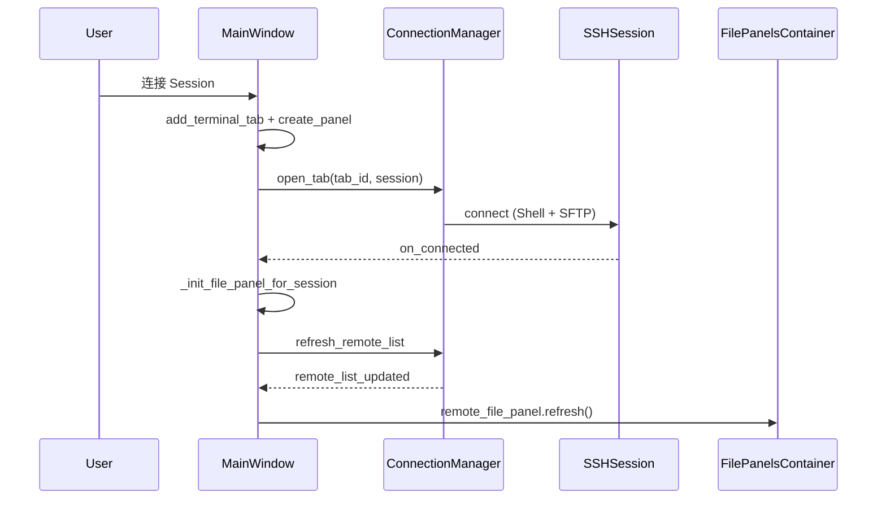
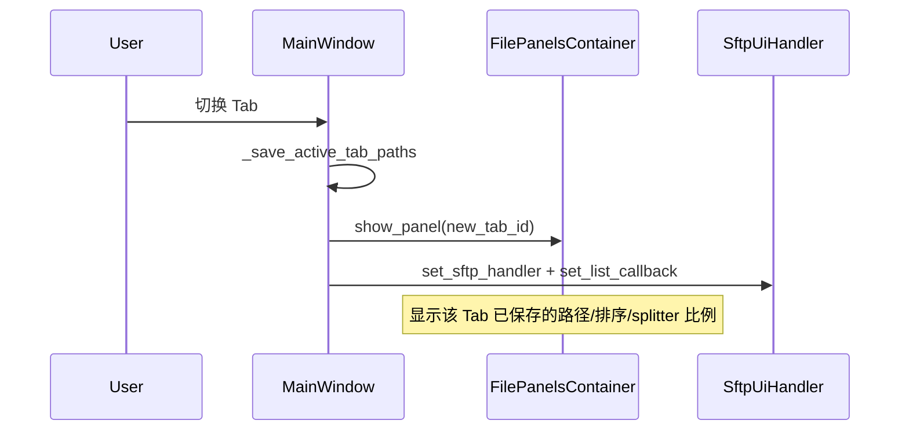

# ykSSH 实现文档

本文档描述 ykSSH 当前代码的架构、数据流与实现细节，供开发者阅读与维护参考。

与 [`AGENTS.md`](AGENTS.md) 的分工：

| 文档 | 面向读者 | 内容侧重 |
|------|----------|----------|
| **AGENTS.md** | AI 代理 / 协作者 | 改动边界、约定、检查清单 |
| **IMPLEMENTATION.md**（本文） | 开发者 | 模块职责、运行时行为、数据流、配置结构 |

---

## 1. 项目概述

**ykSSH** 是一款本地桌面 **PyQt5 SSH 客户端**，功能类似 WindTerm：

- 左侧 Session 树（分组 + 连接配置）
- 右侧多 Tab 终端（VT100 仿真）
- 底部双栏文件面板（本地目录 + 远程 SFTP）
- 无边框窗口、三套主题（solarized / light / dark）、中英文界面

**技术栈：** PyQt5 · asyncssh · qasync · pyte · cryptography（Fernet 密码加密）

**参考项目：**

- UI / 主题 / i18n：[`http-requester`](../http-requester)
- 终端 VT 控件：[`nebula-shell`](../nebula-shell)（已移植为 PyQt5）

---

## 2. 依赖与运行环境

```
PyQt5>=5.15
asyncssh>=2.14
pyte>=0.8
qasync>=0.27
cryptography>=42.0
colorama
loguru
```

- **Python：** 3.10+
- **平台：** 主要面向 Windows（字体默认值含 Microsoft YaHei UI / Consolas）
- **启动：**

```powershell
cd E:\codes\python\ykSSH
pip install -r requirements.txt
python main.py
```

---

## 3. 启动流程

```
main.py
  ├─ config_logger()            # logs/ykssh.log
  ├─ init_app_config()          # 加载 config/config.json
  ├─ QApplication + Fusion 样式
  ├─ install_*_translations()   # 对话框 / 右键菜单 i18n
  ├─ init_i18n(language)
  ├─ qasync.QEventLoop(app)     # asyncio 与 Qt 事件循环合并
  ├─ apply_app_font / apply_app_theme
  └─ MainWindow.show()
```

工作目录规则（`main.py`）：

- 打包 exe：以 exe 所在目录为根
- 源码运行：以 `main.py` 所在目录为根

所有配置文件位于 `<APP_DIR>/config/`。

---

## 4. 目录结构与模块职责

```
ykSSH/
├── main.py                      # 应用入口
├── app_info.py                  # APP_NAME / APP_VERSION
├── log_util.py                  # loguru 日志封装
│
├── models/
│   ├── session_item.py          # SessionItem 树节点 dataclass
│   ├── app_config.py            # config.json 类型化只读模型
│   └── favorite_path.py         # FavoritePath（path + note）
│
├── core/
│   ├── ssh_session.py           # 单条 SSH 连接（Shell PTY + SFTP）
│   ├── connection_manager.py    # tab_id ↔ SSHSession 映射与远程列表缓存
│   ├── terminal_port.py         # connection 层使用的终端能力协议
│   ├── path_resolver.py         # 本地/远程初始路径解析
│   ├── file_permissions.py      # 本地/远程权限字符串格式化
│   └── sftp_service.py          # SFTP 异步 CRUD（listdir/upload/…）
│
├── storage/
│   ├── paths.py                 # config/ 路径常量
│   ├── app_config.py            # config.json 读写与 normalize
│   ├── appearance_defaults.py   # 外观与字体配置默认值
│   ├── file_panel_defaults.py   # 文件面板配置默认值及列宽工具
│   ├── side_panel_defaults.py   # 侧栏对话框尺寸默认值
│   ├── editor_defaults.py       # 外部编辑器与远端大文件阈值默认值
│   ├── theme_defaults.py        # 三套主题默认色值
│   ├── session_profile_store.py # sessions.json（Session 树）
│   ├── command_store.py         # commands.json（快捷命令树）
│   ├── command_history_store.py # 内存历史命令（按运行时 Tab 分桶）
│   ├── credential_store.py      # credentials.json（Fernet 加密密码）
│   ├── secret_key.py            # secret.key 生成/加载
│   ├── host_key_store.py         # host_keys.json（SSH 服务器 TOFU 公钥）
│
├── i18n/
│   ├── translator.py            # tr() 引擎
│   └── builtin_strings.py       # 英文 fallback 字符串
│
├── Languages/
│   ├── en/strings.txt
│   └── zh-CN/strings.txt
│
└── ui/
    ├── main_window.py           # 主窗口：布局、连接生命周期、Tab 切换
    ├── sftp_ui_handler.py       # 文件面板 UI ↔ core.sftp_service 桥接
    ├── window_title_bar.py      # 无边框标题栏 + 菜单（见 §5.1）
    ├── side_panel.py            # 左侧抽屉容器及 Session/快捷命令树
    ├── command_dialog.py        # 快捷命令编辑对话框
    ├── command_history_panel.py # 按运行时 Tab 隔离的历史命令列表
    ├── favorite_tree_widget.py  # 可拖拽 QTreeWidget
    ├── session_dialog.py        # 新建/编辑 Session
    ├── terminal_tab_widget.py   # 终端 Tab 容器
    ├── terminal_vt_widget.py    # pyte 终端渲染（~2000 行）
    ├── file_panel/              # 文件面板基类、本地/远端 Table、控件与每 Tab 容器（见 §6.3）
    ├── file_table_panel.py      # 文件面板旧导入路径的薄兼容入口
    ├── favorites_dialog.py      # 本地/远端收藏管理（非模态）
    ├── theme.py                 # 主题、字体及动态样式参数
    ├── theme_stylesheet.py      # 应用级 QSS 模板
    ├── dialog_common.py         # 对话框布局辅助
    ├── dialog_i18n.py           # QMessageBox 等翻译
    ├── prompt_dialog.py         # 文本输入框
    ├── settings_dialog.py       # 设置（主题/字体/语言）
    ├── about_dialog.py          # 关于
    └── widgets.py               # ArrowComboBox / GlyphSpinBox 等
```

---

## 5. 主窗口布局

```
┌──────────────────────────────────────────────────────────┐
│ WindowTitleBar（Session / Settings / Help 菜单）            │
├──────────────┬───────────────────────────────────────────┤
│ SidePanel    │  TerminalTabWidget                        │
│ Sessions /   │    └─ TerminalVTWidget（每 Tab 一个）        │  main_splitter（水平）
│ Commands /   │                                           │
│ History      │                                           │
├──────────────┴───────────────────────────────────────────┤
│ FilePanelsContainer（QStackedWidget）                      │  vertical_splitter（垂直）
│   └─ FilesPanel（每 Tab 一个，切换时显示/隐藏）              │
└──────────────────────────────────────────────────────────┘
```

**Splitter / 窗口持久化：** 写入 `config/config.json`：

| 字段 | 含义 |
|------|------|
| `window.width` / `window.height` | 主窗口尺寸 |
| `window.side_panel_width` | 左侧 SidePanel 像素宽度（水平 splitter 左侧；字段名沿用历史命名） |
| `window.vertical_splitter_ratio` | 终端|文件面板垂直比例（0~1） |
| `window.tab_bar_height` / `window.title_bar_height` / `window.border_width` | Tab 栏 / 标题栏 / 边框高度 |

拖动 splitter 后 500ms 防抖保存（`MainWindow._schedule_session_save`）。当前处于开发阶段，配置字段以当前 schema 为准，不为旧字段保留兼容分支。

### 5.1 无边框标题栏拖动（Windows）

`WindowTitleBar` 在标题文字区域用 `window.move()` **手动拖动**，**不**调用 `QWindow.startSystemMove()`。

- **原因：** `startSystemMove()` 在 MouseButtonPress 时由系统接管鼠标后，Qt 收不到完整 press/release，导致最小化/最大化/关闭按钮的 `:hover` 高亮失效。
- **代价：** 无 Windows 原生贴边吸附（Aero Snap）。
- 详情与已验证无效方案见 `ui/window_title_bar.py` 类 docstring。

---

## 6. 核心子系统

### 6.1 asyncio + Qt（qasync）

所有 SSH/SFTP 操作在 **qasync 事件循环**内以 `async/await` 执行；UI 更新通过 **pyqtSignal** 或 `asyncio.create_task()` 回到主线程。

```python
# main.py
loop = qasync.QEventLoop(app)
asyncio.set_event_loop(loop)
```

**禁止**在 QThread 中另起 asyncio 循环连接 SSH。

### 6.2 Session 树数据模型

`SessionItem`（`models/session_item.py`）：

| 类型 | 判定 | 字段 |
|------|------|------|
| 分组（folder） | `host` 为空 | `id`, `name`, `children[]` |
| Session（leaf） | `host` 非空 | 上述 + `host`, `port`, `username`, `auth_type`, `key_path`, `local_path`, `remote_path`, `info`, `local_favorites[]`, `remote_favorites[]` |

- 密码 **不** 写入 `sessions.json`，仅存 `config/credentials.json`（Fernet 加密，密钥在 `config/secret.key`）。
- 树 UI 使用 `FavoriteTreeWidget`；CRUD / 拖拽后 `_sync_data_model()` 同步回 `List[SessionItem]` 并由 `SessionProfileStore` 持久化。

### 6.3 文件面板架构（每 Tab 独立）

早期版本所有 Tab 共用一个文件 Table，导致排序/路径互相干扰。当前架构：

```
FilePanelsContainer                    # 主窗口底部，QStackedWidget
├── FilesPanel（tab_id = A）
│   ├── LocalFilePanel                 # 工具栏 + LocalFileTable + statusbar
│   │     ├── toolbar: 标签 | 路径框 | _FileNavToolbar
│   │     └── statusbar: file_filter_edit | 选中统计 | 上传速度/图标
│   ├── EqualSplitSplitter             # 本地|远端分割，比例各 Tab 独立
│   └── RemoteFilePanel                # 工具栏 + RemoteFileTable / 未连接占位 + statusbar
│         ├── toolbar: 标签 | 路径框 | _FileNavToolbar
│         └── statusbar: file_filter_edit | 选中统计 | 下载速度/图标
├── FilesPanel（tab_id = B）
└── _empty                             # 无 Tab 时的空白页
```

**类职责（`ui/file_panel/`）：**

| 类 | 职责 |
|----|------|
| `LocalFileTable` / `RemoteFileTable` | 排序、目录浏览、双击进入子目录；空白区双击返回上级 |
| `_FileNavToolbar` | 导航快捷按钮（见下）；`objectName: fileNavToolbar` |
| `_FilePanelStatusBar` | 底部状态栏：按键触发的隐藏过滤框、文件/文件夹选中统计、传输速度与方向图标 |
| `LocalFilePanel` / `RemoteFilePanel` | 路径编辑框 + 导航栏 + Table 容器 |
| `FilesPanel` | 组合本地 + splitter + 远端 |
| `FilePanelsContainer` | 按 `tab_id` 创建/销毁/切换 FilesPanel |

**导航工具栏（`_FileNavToolbar`）：**

| 环境 | 按钮（从左到右） |
|------|------------------|
| 本地 Windows | 各盘符（`GetLogicalDrives`）→ `/`（当前盘根）→ `~` → 收藏 → 刷新 |
| 本地非 Windows / 远端 | `/` → `~` → 收藏 → 刷新 |

- 按钮为正方形（边长 = `file_panel.file_panel_toolbar_height`）。
- 远端 `~` 使用连接用户的真实主目录：连接后以 SFTP `realpath('.')`/用户信息解析并写入 `SftpUiHandler.remote_home`；Session 配置的 `remote_path` 只作为首次打开目录和 Shell `cd` 目标，不再覆盖 `~`。
- 本地 `~` 为 `os.path.expanduser('~')`；Windows 下 `/` 跳转到当前路径所在盘根（如 `D:\`）。
- 工具栏与 Table 间距：`_FILE_PANEL_TOOLBAR_TABLE_SPACING`（4px）。
- 文件 table 获焦时输入普通字符会显示 statusbar 的 `file_filter_edit` 并把字符送入过滤框；`Ctrl+F` 显示过滤框并聚焦；`ab` 匹配 `ab*`，`*ab` 匹配 `*ab*`，`*ab*dd` 匹配 `*ab*dd*`；中文名称额外支持按拼音首字母过滤（如 `zw` 匹配“中文测试”），首字符为单个多音汉字或后接非汉字时允许首字母多音变体（如“长”和“长abc.txt”可用 `c`/`z`，而“长度”按默认读音 `cd`）；ESC 或路径变化清除过滤。
- 文件 table 获焦时 `Ctrl+D` 打开收藏菜单；菜单路径前 10 项显示 `1..9,0` 数字前缀，菜单打开时按对应数字直接跳转。Enter 在当前行单选文件夹时进入该目录，否则使用系统关联程序打开所选文件（多选时忽略文件夹）。
- 本地文件 table：**Delete** → 回收站（无确认）；**Shift+Delete** → 永久删除（无确认）。右键菜单默认「移到回收站」；按住 **Shift** 再右键则显示「永久删除」并弹确认（对齐资源管理器习惯）。远端 Delete 弹确认后删除，Shift+Delete 直接删除。
- 本地/远端文件可通过右键菜单或文件表格获得焦点时按 **F2** 重命名，名称列显示行内 `QLineEdit`：文件按常见单/复合后缀智能选中名称部分（如 `abc.test.tar.gz` 选中 `abc.test`），未知后缀或目录选中全名；**Esc** 取消，**Enter** 或编辑框失焦提交。
- 本地/远端右键「属性」可编辑权限：对话框显示选择项目数；存在直接选中的文件时额外显示文件数、文件总大小和精确字节数，只有文件夹时不显示大小（不递归统计文件夹内容）。Unix/远端显示 owner/group/others 的 rwx；Windows 本地因 `os.chmod` 只能可靠控制只读标志，按资源管理器习惯仅显示单一“只读”选项（取消即恢复可写）。多选时权限位以三态显示：半选表示各项目值不一致并保持原值，用户点击后只在勾选/取消间切换；选中目录时可递归应用。本地递归通过 `asyncio.to_thread` 后台执行；远端先通过 SFTP 枚举且不跟随 symlink，再以每批 16 项并发 `chmod(..., follow_symlinks=False)`。执行期间文件面板 statusbar 显示齿轮图标，tooltip 显示已处理/总数及失败数，完成后刷新列表。
- **上传/下载仅通过右键菜单发起**（不支持文件面板拖拽互传）。默认上传到右侧远端面板当前路径、下载到左侧本地面板当前路径；远端右键菜单另提供“下载到其它位置...”用于选择一次性本地目标目录，不改变左侧面板当前路径。活动传输期间 statusbar 显示速度、百分比与方向图标，底部约 4px 进度条，空闲时隐藏。上传与下载独立统计，可双向同时显示；tooltip 显示已传/总大小。
- SFTP 上传/下载由 `core/sftp_service.py` 递归直接写入目标路径，不使用完成后搬移的临时文件。冲突对话框经非阻塞 `ask_transfer_conflict_async` 弹出（不卡住 qasync）；传输/远端操作失败 warning 同样为非阻塞 async dialog，关闭/取消任务时会自动收起。选项：覆盖、续传、全部覆盖、全部续传、取消；续传按目标已有大小继续写，目标大于源文件时自动从头覆盖。同名但类型不同（文件 ↔ 文件夹）时，覆盖会先删除目标再写入源对象，续传不会做类型转换并会中止当前冲突项。每个文件/文件夹完成后同步目标 mtime。冲突取消中止剩余项目，不回滚已写入内容。远端列表与下载会 follow 指向目录的 symlink，使其可进入/递归下载；目录下载与下载前体积统计使用 `realpath` 记录已访问目录，遇到环路会跳过递归分支；远端删除对 symlink 使用 `lstat`，只删链接本身不跟随目标。关闭 Tab 或退出程序时若仍有传输/远端改名/删除/新建等后台任务，会提示是否中断；确认后 cancel 并 **await 任务结束** 再 disconnect，保留已写入内容。

**收藏（★）：**

| 范围 | 存储 | 菜单内容 |
|------|------|----------|
| 全局本地 | `config.json` → `file_panel.local_favorites` | 本地 ★ 菜单中列出 |
| Session 本地 | `sessions.json` → Session `local_favorites` | 本地 ★ 菜单中列出 |
| Session 远端 | `sessions.json` → Session `remote_favorites` | 远端 ★ 菜单中列出 |

- 条目结构：`{"path": "...", "note": "...", "is_file": true|false}`（`models/favorite_path.py` → `FavoritePath`）；`is_file` 可省略表示未知，点击收藏成功判断当前远端/本地路径类型后会写回。菜单显示 `路径` 或 `路径 (备注)`。
- 点击 ★：弹出菜单「管理收藏」+ 对应列表；点路径跳转；点「管理收藏」打开**非模态**对话框（`ui/favorites_dialog.py`）。
- 本地管理对话框：左全局 / 右 Session；路径可粘贴、手动输入或浏览选择（浏览结果经 `os.path.normpath`，Windows 下 `D:/x` → `D:\x`）。
- 远端管理对话框：仅 Session 列表；路径仅粘贴或手动输入（无浏览）。
- 管理对话框支持添加、删除、上移、下移收藏；浏览选择本地路径添加后保持普通选中状态，不自动进入单元格编辑。
- 点击收藏路径时若路径指向文件，会进入该文件所在目录并选中文件；远端路径通过 SFTP `lstat/stat` 判断文件/目录，类型变化会更新 `is_file`；路径不存在时逐级尝试父目录，直到可进入的父目录或 `/`。
- 关闭管理对话框时写入窗口尺寸（`file_panel.local/remote_favorites_dialog_width/height`），下次打开恢复。
- Session / 快捷命令 **编辑** 对话框关闭时写入 `side_panel.session_edit_dialog_*` / `side_panel.command_edit_dialog_*`，再次编辑时恢复。
- 不自动去重；收藏内容经 `save_file_panel_local_favorites` / `SidePanel.persist_sessions()` 保存。
- `MainWindow._register_files_panel` 注入 provider / manage handler（按 `tab_id` 取 `SSHSession.session_item`）。

**状态隔离规则：**

| 状态 | 范围 |
|------|------|
| 路径、排序、目录浏览 | 每 Tab 独立（各自 Table 实例） |
| 本地/远端 splitter 比例 | 每 Tab 独立（首次显示时初始化 1:1，之后保留用户拖动结果） |
| 列宽 | **全局共享**（表头右键「保存列宽」→ 写入 config + 同步所有 Tab 的对应 Table） |
| 文件夹名称粗体、工具栏高度/字号 | **全局**（`file_panel.*`，见 §8.2） |

**远程列表加载机制：**

1. `ConnectionManager.get_remote_list_callback(tab_id)` 返回同步回调
2. 回调先读 `_remote_cache`；未命中则 `asyncio.create_task(refresh_remote_list)` 并返回空列表
3. 异步完成后 emit `remote_list_updated(tab_id)` → 刷新当前 Tab 的 `RemoteFileTable`

**SFTP 操作桥接：** `SftpUiHandler` 接收 Table 的 signal（upload/download/delete/rename/mkdir），内部 `asyncio.create_task` 调用 `sftp_service`，完成后 `on_refresh_ui` 刷新文件列表。

**列表数据：** `sftp_service.listdir` 与本地 `listdir` 均跳过 `.` / `..`，由 Table 在非根目录时自行插入一行 `..`（`is_parent=True`），避免与服务器返回的条目重复。

### 6.4 终端 I/O 数据流

```
SSH stdout  → SSHSession._read_loop → data_received(str)
           → ConnectionManager._on_data → TerminalVTWidget.write_text()

TerminalVTWidget.input_received(bytes) → SSHSession.write() → SSH stdin
```

- 连接时创建 `xterm-256color` PTY，尺寸经 `TerminalPort.terminal_size()` 获取
- 窗口 resize 时对当前 Tab 调用 `ConnectionManager.resize_terminal()`
- Tab 关闭：`ConnectionManager.close_tab()` cancel 读任务并 `disconnect()`
- 远程会话曾成功连接后异常断开时，终端显示 `Disconnected` 与「按 Enter 重新连接」提示，并进入可重连模式：`Enter`/`Return` 触发 `TerminalVTWidget.reconnect_requested`，由 `MainWindow` 复用同一 `tab_id`/终端/文件面板再次 `open_tab`；首次连接失败不启用该模式。重连失败时先输出错误行，再输出重连提示。重连成功后恢复远端路径栏并刷新文件列表（`clear_remote` 会清空路径栏，需按 handler 上次目录 `set_path`）。`MainWindow` 用 `_tab_sessions` 在断线后仍保留 Session 配置，用 `_tabs_ever_connected` 区分「曾连上」与「从未连上」。
- 终端复制/粘贴快捷键：`Ctrl+Shift+C/V` 与 `Shift+Delete` / `Shift+Insert`；`Alt+Backspace` 发送标准 `ESC DEL` 向前按词删除，`Alt+Delete` 发送 `ESC d` 向后按词删除，`Alt+Left/Right` 发送 `ESC b/f` 按词移动；`Ctrl+A/E` 原样发送给远端 shell/readline/zsh/fish，用于移动到当前输入行首/行尾。焦点不在终端时，`Ctrl+L` 将焦点切回当前终端；焦点已在终端时不拦截，仍向远端发送标准 `Ctrl+L` 清屏。主屏幕的 `Ctrl+Shift+Home/End` 跳到本地 scrollback 最前/最新位置，备用屏幕不拦截以避免破坏 TUI；在历史位置按 Enter 会先恢复到最新输出再发送回车。右键菜单显示 `C/V/A/X/F` 快捷键，分别触发复制、粘贴、全选、清屏、跟随输出。
- 终端滚轮默认按现有行数滚动；按住 **Ctrl** 滚轮时每个滚轮刻度快速滚动“可见一屏减 1 行”，使相邻两屏保留一行重叠内容。主屏幕直接滚动本地 scrollback；备用屏幕（如 vim）发送一次 PageUp/PageDown，并优先于远端鼠标上报。

#### 终端快捷键速查

| 快捷键 | 行为 | 处理位置 |
|---|---|---|
| `Ctrl+Shift+C` / `Shift+Delete` | 复制终端选区 | 本地终端 |
| `Ctrl+Shift+V` / `Shift+Insert` | 粘贴 | 本地终端 |
| `Ctrl+A` / `Ctrl+E` | 移动到当前输入行首/行尾 | 发送给远端 shell |
| `Ctrl+L` | 焦点不在终端时切回当前终端；焦点已在终端时清屏 | 焦点外：`MainWindow.eventFilter`；焦点在终端：发送给远端 |
| `Alt+Left` / `Alt+Right` | 向左/向右移动一个词 | 发送 `ESC b/f` |
| `Alt+Backspace` / `Alt+Delete` | 删除前一个/后一个词 | 发送 `ESC DEL` / `ESC d` |
| `Ctrl+Shift+Home` / `Ctrl+Shift+End` | 跳到最早 scrollback / 返回最新输出 | 仅主屏幕本地处理 |
| `Ctrl+滚轮` | 每个刻度滚动一屏减一行 | 主屏幕本地处理；备用屏幕发送 PageUp/PageDown |

`Ctrl+Shift+Home/End` 不在备用屏幕中拦截，避免影响 Vim 等 TUI 对 Home/End 的依赖。主屏幕停留在历史位置时，凡是将发送给远端并改变/导航输入的键盘操作（普通输入、IME、粘贴、方向键、按词移动/删除、Backspace/Delete、Ctrl+A/E、Enter 等）都会先恢复最新输出；复制和 scrollback 跳转等纯本地操作不触发恢复。

- 终端获得焦点时绘制 1px 高亮边框，颜色由当前主题 `themes.<name>.terminal_focus_border` 配置（solarized `#cb4b16` / light `#e67e22` / dark `#f0a030`）。
- 终端正文背景由 `terminal.terminal_background_color` 配置，拖选背景由 `terminal.terminal_selection_background_color` 配置；左侧有 `terminal.terminal_left_gutter_width_px` 控制的整行选择空白区（默认 16px，0 表示关闭），背景由 `terminal.terminal_gutter_background_color` 配置。左键点击将选择起点映射到该行第 0 列、终点映射到行尾；拖动时若鼠标仍在空白区则终点按方向映射到所在行行首/行尾，沿用终端原有拖选流程，坐标按下述终端坐标规则转换。终端正文连续三次左键点击选择整行；点击/拖选高亮在当前输入行按最后一个可见字符裁剪，不延伸到输入行尾空白区。
- 终端右侧 scrollbar 由 `terminal.terminal_scrollbar_width_px` 控制（默认 10px，0 表示关闭），轨道和滑块颜色分别由 `terminal.terminal_scrollbar_background_color` / `terminal.terminal_scrollbar_thumb_color` 配置。scrollbar 为自绘轨道 + 矩形滑块，无两端单行点击按钮；点击轨道跳转到对应 scrollback 位置，拖动滑块滚动。
- 终端坐标规则：内部状态应优先保存为 scrollback 缓冲区中的绝对行号，屏幕行只作为当前 viewport 的临时表现。鼠标点击、双击、拖选、命令起点记录等事件入口，应先把可见屏幕行换算为缓冲区绝对行再保存；手动 scrollback 滚动或实时输出触发滚屏时，只更新 viewport 起点，不直接平移已保存的绝对行号；绘制选区、复制可见内容、gutter 命令块选择等输出侧逻辑，再把绝对行换算回当前可见屏幕行。这个规则可避免长输出（如 `ping`）把命令起始行或选区锚点推入历史区后出现漂移。
- 终端会按本地输入记录命令起始行：首次输入普通命令内容时记录当前光标所在的缓冲区绝对行，按 Enter 提交为命令标记并记录本地命令发送时间；普通键盘输入仅在当前终端行可见回显出命令时，才通过 `TerminalVTWidget.command_submitted(command, sent_at)` 通知左侧历史命令面板，避免记录密码提示等未回显输入；快捷命令右键「发送并执行」由客户端主动执行，可直接写入历史。历史命令仅在内存中按运行时 `tab_id` 分开保存和显示，切换 Tab 时左侧 History 抽屉只显示当前 Tab 的历史，关闭 Tab 时删除该 Tab 的历史桶。以 `\` 结尾的输入行视为多行命令，暂不提交新的命令标记。鼠标移动到左侧 gutter 的命令块区域时，tooltip 显示该命令的发送时间；gutter 双击选择命令块：从该命令起始行到下一个命令起始行前一行；最后一个命令选到当前输入行前一行（实时输出中的最后一行可能仍在变化，可接受）。alt-screen 中 gutter 双击退回单行选择。
- 左侧 History 抽屉按 `tab_id` 记住各自列表 scrollbar 位置，切换 Tab 时会恢复当前 Tab 历史列表上次滚动位置。历史项保存对应终端命令块的 `command_start_row` 绝对行号；单击某条历史时，会在当前活动终端中直接按该绝对行号滚动到对应命令块；如果对应命令已被 `clear` 清掉或已经不在 scrollback 中，则忽略跳转。快捷命令或历史命令双击只把命令填入当前活动终端（不发送 CR），终端获得焦点，需用户按 Enter 才执行。命令树与历史列表右键提供「发送」（填入不执行）和「发送并执行」；调用后终端获得焦点。命令树叶子与历史项另有「复制命令」，将命令文本写入剪贴板。
- 远端 `clear`/`Ctrl+L` 等发出主屏全屏清除序列（如 `ESC[H ESC[2J` 或 `ESC[3J`）时，会重置本地选区、命令起点记录、viewport 绝对基准与 pyte history 队列；之后的新命令从清屏后的缓冲区重新建立绝对行坐标。
- `terminal.terminal_debug_gutter_selection` 打开时，终端会把实时输出滚屏、手动 scrollback 滚动、gutter 双击命令块选择的坐标换算过程写入 `logs/terminal_debug.log`，用于排查长输出场景下的选区漂移问题。
- `terminal.terminal_debug_history_jump` 打开时，历史命令单击定位会把请求参数、命令标记、时间/命令校验结果、跳转前后 viewport/scrollback 状态写入 `logs/terminal_history_jump.log`，用于排查 History 定位异常。
- 其它自定义右键菜单也显示并响应单键热键：常用约定包括 `R` 刷新、`N` 新建文件夹、`C/P/L` 复制名称/路径/当前目录、`C` 复制命令（快捷命令树叶子 / 历史项）、`H` 复制 Host（Session 树叶子 / 终端 Tab）、`T` 上传/下载传输或发送并执行（快捷命令 / 历史）、`F2` 重命名、`F3`/`F4` 使用系统关联程序/配置编辑器打开、`E` 编辑 Session/快捷命令、`D` 删除、`X` 剪切/清屏、`S` 发送（快捷命令 / 历史）或保存列宽、`M` 管理收藏、`V` 粘贴、`A/L` 展开/折叠。
- 粘贴时仅在配置允许且远端显式开启 `DECSET ?2004` bracketed paste 模式后才发送 `ESC[200~...ESC[201~` 包装；普通 shell 密码提示（如 `sudo`）不发送该包装，避免控制序列被当作密码字符。
- 多行粘贴且 `terminal_paste_confirm_multiline` 开启时，弹出可编辑确认框（完整文本、`QPlainTextEdit`）；用户可修改后点「是」或按 `Alt+Y` 粘贴编辑结果，按 `Alt+N` 取消；快捷键在编辑框聚焦时仍有效；对话框可拖动改大小，初始尺寸按内容在屏占比上限内自动扩展。

### 6.5 连接生命周期

```
用户双击 Session / 点击 Connect
  → MainWindow._connect_session_async
      1. terminal_tabs.add_terminal_tab()        → 新 tab_id + TerminalVTWidget
      2. file_panels.create_panel(tab_id)        → 新 FilesPanel
      3. connection_manager.open_tab()
           → SSHSession.connect（Shell + SFTP）
           → on_connected → _init_file_panel_for_session
                → resolve 本地/远程路径
                → 若配置了 remote_path：cd_shell 发送 cd 到 Shell
                → refresh_remote_list
                → _attach_file_panel（绑定 SftpUiHandler + list callback）

Tab 切换
  → _save_active_tab_paths（handler 记录路径）
  → file_panels.show_panel(new_tab_id)
  → _attach_file_panel（重新绑定 handler / callback）

Tab 关闭（双击 Tab 栏；无关闭按钮）
  → 若有后台 SFTP 任务：确认 → cancel → await wait_transfers_closed
  → force_close_tab
  → pop handler / 关收藏对话框 / remove_panel
  → cancel 连接中 task（若 connect 尚未完成）
  → await close_tab（abort 连接中会话、cancel 读任务、disconnect、deleteLater）
  → handler.deleteLater()
```

**关键映射表（MainWindow）：**

| 字典 | 键 | 值 |
|------|----|----|
| `_active_tab_id` | — | 当前终端 Tab ID |
| `_sftp_handlers` | tab_id | SftpUiHandler |
| ConnectionManager._sessions | tab_id | SSHSession |
| ConnectionManager._terminals | tab_id | TerminalVTWidget |
| FilePanelsContainer._panels | tab_id | FilesPanel |
| TerminalTabWidget._tab_ids | tab index | tab_id |

---

## 7. SSH 连接实现

`SSHSession`（`core/ssh_session.py`）：

- 认证前使用 `asyncssh.get_server_host_key()` 获取服务器主机密钥，并由 `HostKeyStore` 执行 TOFU 校验；首次连接展示算法和 SHA256 指纹供用户确认，确认后写入 `config/host_keys.json`，后续指纹变化会阻止连接。实际 `asyncssh.connect()` 使用本次已确认密钥构造的 `known_hosts` 再次校验，避免探测与认证之间密钥被替换；`connect_timeout` / `login_timeout` 当前为 15 秒
- 认证：`AUTH_PASSWORD`（密码来自 CredentialStore）或 `AUTH_PUBLIC_KEY`（`key_path`）
- 同时打开 Shell process 与 SFTP client
- Signal：`connected` / `disconnected` / `data_received` / `error`
- 若远端主动断开或读循环结束，`ConnectionManager` 会移除对应 `_sessions` / 远端缓存并断开 Qt signal，MainWindow 会取消该 Tab 的 SFTP 任务并清空远端文件面板；曾成功连接的终端进入可重连模式，可按 Enter 在原 Tab 中重连，首次连接失败则不启用该模式。

`ConnectionManager.cd_shell()`：向交互式 Shell 写入 `cd <path>\r`（延迟 150ms 等待 banner），使终端工作目录与文件面板远端路径一致。

---

## 8. 配置与持久化

### 8.1 配置文件一览

| 文件 | 内容 | 是否含敏感信息 |
|------|------|----------------|
| `config/config.json` | 主题色、外观、语言、窗口尺寸、Session 树宽度、splitter 比例、文件面板布局 | 否 |
| `config/sessions.json` | Session 树 JSON（无密码） | 否 |
| `config/commands.json` | 快捷命令树（分组、显示名、命令详情、命令解释） | 否 |
| `config/credentials.json` | Fernet 加密密码 `passwords[session_id]` | **是** |
| `config/secret.key` | 解密 credentials 的密钥 | **是** |
| `config/host_keys.json` | 用户已信任的 SSH 服务器公钥（TOFU） | 否 |

> **注意：** 窗口状态保存在 `config.json` 的 `window` 段，**不是**单独的 `session.json`。

### 8.2 config.json 主要 Schema

```json
{
  "version": 1,
  "themes": {
    "solarized": { "background_primary": "...", "tab_background": "...", ... },
    "light": { ... },
    "dark": { ... }
  },
  "appearance": {
    "theme": "solarized",
    "ui_font_size_px": 14,
    "table_font_size_px": 14,
    "status_font_size_px": 12,
    "tree_font_size_px": 14,
    "tree_row_height_px": 26,
    "filter_edit_height": 26,
    "filter_edit_font_size_px": 14,
    "terminal_font_family": "Consolas",
    "terminal_font_size_px": 22,
    ...
  },
  "language": "en",
  "terminal": {
    "terminal_scrollback_lines": 5000,
    "terminal_reflow_buffer_chars": 200000,
    "terminal_experimental_raw_reflow_on_resize": false,
    "terminal_paste_confirm_multiline": true,
    "terminal_bracketed_paste": true,
    "terminal_background_color": "#1E1E1E",
    "terminal_selection_background_color": "#094771",
    "terminal_left_gutter_width_px": 16,
    "terminal_gutter_background_color": "#323232",
    "terminal_scrollbar_width_px": 10,
    "terminal_scrollbar_background_color": "#323232",
    "terminal_scrollbar_thumb_color": "#6A6A6A",
    "terminal_debug_gutter_selection": false,
    "terminal_debug_history_jump": false
  },
  "window": {
    "width": 1400,
    "height": 900,
    "side_panel_width": 206,
    "vertical_splitter_ratio": 0.636,
    "border_width": 1,
    "title_bar_height": 32,
    "tab_bar_height": 28
  },
  "file_panel": {
    "local_column_widths": {
      "Name": 460,
      "Size": 96,
      "Modified": 144,
      "Permissions": 100
    },
    "remote_column_widths": {
      "Name": 460,
      "Size": 96,
      "Modified": 144,
      "Permissions": 100
    },
    "file_table_header_height": 22,
    "file_table_row_height": 24,
    "file_panel_toolbar_height": 26,
    "file_panel_toolbar_font_size": 14,
    "file_panel_statusbar_font_size": 13,
    "file_panel_favorites_menu_font_size": 14,
    "file_panel_folder_name_bold": true,
    "local_favorites": [
      { "path": "D:\\\\Projects", "note": "work" }
    ],
    "local_favorites_dialog_width": 820,
    "local_favorites_dialog_height": 420,
    "remote_favorites_dialog_width": 560,
    "remote_favorites_dialog_height": 380
  },
  "side_panel": {
    "session_edit_dialog_width": 800,
    "session_edit_dialog_height": 520,
    "command_edit_dialog_width": 680,
    "command_edit_dialog_height": 320
  },
  "editor": {
    "executable_path": "C:\\Program Files\\Notepad++\\notepad++.exe",
    "remote_large_file_mb": 10
  }
}
```

| `file_panel` 字段 | 说明 |
|-------------------|------|
| `*_column_widths` | 本地/远端列宽 dict（键为列名如 `Name`/`Size`/`Modified`/`Permissions`；表头右键「保存列宽」写入） |
| `file_table_header_height` / `file_table_row_height` | 表头 / 行高 |
| `file_panel_toolbar_height` / `file_panel_toolbar_font_size` | 路径栏高度、标签、路径输入框与导航按钮字号 |
| `file_panel_statusbar_font_size` | 文件面板底部 statusbar 字号 |
| `file_panel_favorites_menu_font_size` | 收藏弹出菜单字号 |
| `file_panel_folder_name_bold` | 文件夹名称是否粗体（默认 `true`；`..` 行也按目录粗体） |
| `local_favorites` | 全局本地收藏路径列表（`path` + 可选 `note`） |
| `local/remote_favorites_dialog_width/height` | 收藏管理对话框窗口尺寸 |

| `side_panel` 字段 | 说明 |
|-------------------|------|
| `session_edit_dialog_width/height` | Session 编辑对话框窗口尺寸（关闭时写入，再次编辑时恢复） |
| `command_edit_dialog_width/height` | 快捷命令编辑对话框窗口尺寸（关闭时写入，再次编辑时恢复） |

| `editor` 字段 | 说明 |
|---------------|------|
| `executable_path` | 默认外部编辑器可执行文件；为空或路径无效时回退系统文件关联 |
| `remote_large_file_mb` | 远端编辑的大文件确认阈值，默认 10 MiB |

`app_config.py` 在加载时对当前 schema 做 **normalize**（合并 `theme_defaults.py` / `appearance_defaults.py` / `file_panel_defaults.py` / `side_panel_defaults.py` / `editor_defaults.py` 默认值并校验范围）。当前处于开发阶段，不保留旧配置字段兼容；稳定版发布后再按发布策略补充迁移规则。

`sessions.json`、`commands.json` 当前只接受 `version: 1`；版本不匹配时丢弃加载结果并记录 warning。当前处于开发阶段，不保留旧 schema 兼容。

### 8.3 密码存储

- `CredentialStore`：Fernet 加密，当前只接受 version 1；解密失败会打 warning 并丢弃无法解密的条目；version 不匹配会拒绝加载整份凭据并阻止后续保存覆盖原文件
- `secret.key` 与 `credentials.json` **必须配对迁移**
- `host_keys.json` 保存已确认的服务器身份；不迁移时目标机器会在首次连接时重新询问指纹
- 若已有 `secret.key` 但内容无效：**不会**静默覆盖生成新钥，启动失败并提示修复（`InvalidSecretKeyError`）
- 删除 Session 树节点（含文件夹）会递归清理对应 `credentials.json` 条目
- `config.json` / `sessions.json` / `commands.json` / `credentials.json` / `host_keys.json` 保存时使用同目录临时文件 + `os.replace()` 原子替换，降低进程中断导致 JSON 截断的风险。

### 8.4 配置目录迁移（WindTerm 风格）

将整个 `config/` 目录复制到另一台电脑的 ykSSH 程序目录下（与 `main.py` 同级），即可直接使用，无需重新配置 Session。

**迁移涉及的文件：**

| 文件 | 说明 |
|------|------|
| `config.json` | 主题、语言、终端/UI 字体、窗口尺寸、Session 树宽度与垂直 splitter 比例 |
| `sessions.json` | Session 树（主机、端口、用户名、本地/远程路径、备注等，无密码） |
| `commands.json` | 快捷命令树 |
| `credentials.json` | Fernet 加密后的 Session 密码 |
| `secret.key` | 解密密码所需的本地密钥 |
| `host_keys.json` | 已确认的 SSH 服务器主机密钥；可选迁移，不迁移时需重新确认指纹 |

**迁移步骤：**

1. 在源机器上关闭 ykssh。
2. 复制整个 `config/` 文件夹到目标机器同名路径（例如 `d:\Codes\Python\ykSSH\config\`）。
3. 在目标机器启动 ykssh；Session 树、密码、外观设置应自动生效。
4. 连接 Session 时，文件面板会打开 Session 中配置的本地/远程路径；路径无效或留空时回退到各自的主目录（`~`）。

**注意事项：**

- `secret.key` 与 `credentials.json` 必须配对；只复制其中一个会导致密码无法解密。
- 当前处于开发阶段，只接受 version 1 的加密 `credentials.json`；旧版明文凭据不会自动迁移。
- 私钥文件本身不在 `config/` 内；若 Session 使用公钥认证，需确保目标机器上 `key_path` 指向的私钥文件存在（或使用 `~/.ssh/id_rsa` 等相对路径）。
- `config/` 含敏感信息，请勿提交到 git 或分享给不可信方。

---

## 9. 主题系统

- 默认色值：`storage/theme_defaults.py`（solarized / light / dark）
- 运行时色板：`ui/theme.py` → `ThemePalette` dataclass
- QSS 由 `build_stylesheet(palette)` 动态生成
- Tab Bar 样式：`tab_background`（非激活）、`tab_selected_background`（激活）、`tab_hover_background`（悬停）
- SidePanel 的 Session、Command、History item 悬停色：`side_panel_item_hover_background`（选中项悬停仍使用 `tree_selected_background`）
- 终端焦点边框：`terminal_focus_border`（终端控件获得焦点时的 1px 描边）
- 文件表格非焦点选中行：`table_inactive_selected_background`（焦点表格仍使用 `table_selected_background`）
- **动态垂直 padding（文字居中）：** Session 过滤框与文件面板路径 `QLineEdit` 按控件高度与 `QFontMetrics.lineSpacing` 计算 `filter_edit_pad_y` / `file_panel_toolbar_pad_y`，控件外框高度不变、仅调整内部 padding
- 导航按钮样式：`#filePanelNavButton`（正方形 flat 按钮）
- 终端配色尚未完全跟随 app theme（已知限制）

修改主题色：同时更新 `storage/theme_defaults.py` 与用户 `config/config.json` 中的 `themes.*`。

### 9.1 运行日志

`main.py` 启动时通过 `log_util.config_logger()` 写入 `logs/ykssh.log`，同时在有 stdout 时输出到控制台。

关键操作会写日志，便于排查连接与文件管理问题：

- SSH：创建连接 Tab、开始连接、连接成功/失败、断开连接、关闭 Tab。
- SSH、SFTP、远程文件和远程编辑日志至少携带 `tab_id`、`session_id`、`name` 之一；Tab 创建后以 `tab_id` 作为跨 `MainWindow → ConnectionManager → SSHSession/SftpUiHandler → sftp_service` 的主追踪键，建连关键日志同时记录 `session_id` 与 `name`。递归 SFTP 操作通过异步上下文继承同一 `tab_id`。
- 文件传输：上传/下载批次开始、单项完成、批次完成、取消、冲突选择、覆盖/续传相关目标处理。
- 文件管理：本地新建/重命名/删除/移动到回收站，远端新建/重命名/递归删除。
- 关闭流程：传输中关闭 Tab 或退出程序时，记录用户取消或确认中断。

常规日志允许记录 session id、主机、端口、用户名、文件路径和错误信息；密码不会写入日志。`terminal_debug_gutter_selection` / `terminal_debug_history_jump` 属于仅供排障的显式调试开关，可能记录终端可见内容或命令文本，其中可能含 Token 等敏感信息；启用后应保护并及时清理对应调试日志。

---

## 10. 国际化（i18n）

- 调用：`tr('namespace.key')`
- 字符串源：`i18n/builtin_strings.py`（英文 fallback）+ `Languages/<locale>/strings.txt`
- 语言切换：`set_language()` → 已注册 `retranslate_ui` 的 Widget 回调
- 对话框按钮：`ui/dialog_i18n.py`（非 Qt `.qm` 文件）
- 新增 UI 文案需 **同时** 更新 `builtin_strings.py`、`Languages/en/strings.txt` 与 `Languages/zh-CN/strings.txt`

---

## 11. 文件 Table 行为细节

### 排序与 `..` 行

- 排序秩：`..`（parent，`SORT_RANK=0`）→ 文件夹（1）→ 文件（2）
- **`..` 在升序与降序下都保持第一行**（`_FileSortItem.__lt__` 按当前排序方向特判 parent）
- 根目录不显示 `..`：本地用 `_is_local_root`（Windows 为盘符根如 `D:\`；Unix 为 `/`）；远端用 `_is_remote_root`（`/`）
- 默认按文件名列升序；列头点击排序（名称不区分大小写）
- 刷新目录时 **保留当前排序**（`_begin_refresh` / `_end_refresh`）
- 各 Tab 独立（各自 Table 实例）

### 导航与交互

- 双击目录 / `..`：进入子目录或上级
- **表格空白区双击**（最后一行下方或最右列右侧）：非根目录时跳转上级（`_BaseFileTable.mouseDoubleClickEvent`）
- 路径栏回车 / 导航工具栏按钮：`set_path` 跳转并刷新
- Home / End：跳转并滚动到当前可见行的第一行 / 最后一行（过滤后只在可见行范围内跳转）
- F3：使用系统文件关联程序打开选中文件（例如音频文件由系统关联播放器打开）。
- F4：使用配置的编辑器打开选中文件；编辑器未配置或路径无效时回退系统文件关联。F3/F4 均会显示在本地及远程文件右键菜单中，多选中的目录会被忽略。
- Enter：单选文件夹时进入该文件夹；否则使用系统关联程序打开选中的文件，多选时忽略文件夹。
- Right：单选文件夹时进入该文件夹；Left：进入父目录；Ctrl+Left：进入本地当前盘符/共享根目录或远端 `/`。
- Alt+Enter：打开当前所选本地或远端项目的属性对话框。
- Ctrl+Up：从文件表格切换到上方路径输入框并全选路径；路径输入框内按 Ctrl+Down 返回文件表格。
- 本地表格 Alt+Right：聚焦远端表格；远端表格 Alt+Left：聚焦本地表格。

### 显示

- `file_panel.file_panel_folder_name_bold`：文件夹名（含 `..`）是否粗体
- 文件表格失焦时使用当前主题的 `table_inactive_selected_background` 绘制选中行，以区分当前获得焦点的本地/远端面板。

### 列宽

- 表头右键「保存列宽」→ `save_file_panel_column_widths()` → 写入 config + 所有 Tab 同步

### 远程 / 本地 Table 右键菜单

- 在未选中行上右键会先清空旧选择并选中鼠标所在行；在已选中行上右键保留当前多选；空白区右键不改变选择。

- **远程：** 刷新、新建目录；有选中项时：使用系统关联程序/配置编辑器打开、复制文件名、复制路径、复制父路径、下载、重命名（单选）、删除。多选复制时各行以换行拼接。
- **本地：** 刷新、新建目录；有选中项时：使用系统关联程序/配置编辑器打开、复制、上传、重命名（单选）、移到回收站（Shift 按下时为永久删除）。
- 编辑动作只处理文件并忽略目录；实际文件达到 3 个时先统一确认。

### 远端文件编辑

- `FileEditManager` 将远端文件下载到系统临时目录的本次运行隔离子目录；远端文件名会映射为 Windows 可接受的安全文件名并保留常见扩展名。下载后将临时文件 mtime 对齐到远端 mtime；同一 Tab 的同一路径重复打开时会重新读取远端 size/mtime，仅在远端签名未变化时复用临时副本，远端已变化则覆盖下载最新副本后再打开。
- 下载前逐文件读取远端 size/mtime；任一文件超过 `editor.remote_large_file_mb` 时统一列出大文件并确认。
- 所有临时文件由一个 `QFileSystemWatcher` 监听，并使用一个 800ms 防抖定时器合并编辑器的连续写入和原子替换事件，不创建逐文件线程或轮询任务。
- 只有本地临时文件内容签名（size + mtime_ns）变化时才提示同步；同步确认框会请求前台显示并在其生命周期内临时置顶，避免被外部编辑器遮挡；拒绝后保持监控，下一次保存会再次提示。
- 上传前比较下载时记录的远端 size/mtime。远端已变化时可覆盖远端、重新下载并放弃本地修改，或取消同步。
- Tab/程序关闭时不对普通未同步修改追加提示；只有上传同步正在进行时复用文件传输中断确认。关闭后尽力删除本次运行临时目录，启动时清理超过 7 天的遗留目录；文件变化会刷新运行目录时间，降低多实例误清理风险。

---

## 12. 典型时序图

### 连接 Session



### Tab 切换



---

## 13. 已知限制与待完善

| 项 | 说明 |
|----|------|
| 文件拖拽互传 | **不支持**；仅右键菜单上传/下载 |
| 标题栏 Aero Snap | 手动 `window.move()` 拖动，无 Windows 贴边吸附（见 §5.1） |
| 终端主题 | VT 配色未完全跟随 app theme |
| 远程目录首次加载 | 可能需二次刷新（async 缓存时序） |
| terminal_vt_widget.py | 从 nebula-shell 移植，可能有 PyQt5 兼容边角 |
| 无换行输出后的输入行重绘 | 复现示例：远端执行 `echo -n "helloworld"`，Shell 提示符会紧接在 `helloworld` 后；随后粘贴 `Content-Type: application/json`，再按任意方向键，readline 可能按“提示符位于第 0 列”重绘并覆盖该行旧输出。WindTerm、MobaXterm 同样可复现，属于远端 readline 的通用行为，暂不在客户端做非标准修正；建议让命令输出以换行结束（如 `curl -w '\n'`） |
| 凭据与密钥同目录 | 能读 `config/` 即等价可读全部 Session 密码 |
| secret.key / credentials.json 权限 | 目前仅文档警告，尚未做跨平台 ACL / chmod 硬化 |
| 收藏按钮图标 | 当前使用 Unicode 星标，后续可改为 QStyle/icon font 以提升跨平台一致性 |
| 远端列表性能 | 大目录仍是 `listdir` + 逐项 `lstat`，待改为 attrs readdir 或有界并发 |
| 下载前体积扫描 | 下载目录前会递归统计大小，大目录开始前可能等待较久 |
| 本地文件 IO | 上传读文件、目录遍历、本地大小统计、本地删除/重命名/新建目录仍有同步 IO，待 `asyncio.to_thread` 或分片让出事件循环 |
| 本地链接上传 | 为避免递归环和越出用户选择目录，符号链接与 Windows 目录联接默认跳过；直接选择链接上传会提示不支持 |
| Tab 重命名 | 右键 Tab 重命名仅修改当前运行时显示标题，不持久化到 `sessions.json` |
| Tab / Session 复制 Host | 右键「复制 Host」将 Session 的 `host` 原样写入剪贴板（不含端口）；Tab 侧在创建时缓存 host，断连后仍可复制 |
| 密码为空 | 密码认证 Session 若未保存密码，不会弹窗补录；连接时按无密码参数尝试并由 SSH 认证失败返回错误 |
| 加密私钥口令 | 公钥认证目前只保存私钥路径，尚未提供加密私钥的口令输入与安全存储 |

---

## 14. 扩展指南

### 新增 UI 字符串

1. `i18n/builtin_strings.py` 添加 key
2. `Languages/en/strings.txt` 与 `Languages/zh-CN/strings.txt` 添加翻译
3. Widget 实现 `retranslate_ui()` 并 `register_retranslator`

### 新增 SFTP 操作

1. 在 `core/sftp_service.py` 添加 async 函数
2. 在 `SftpUiHandler` 添加槽/async 方法
3. 在 `RemoteFileTable` 添加上下文菜单或 signal
4. 在 `RemoteFilePanel.set_sftp_handler` 中 connect

目录上传/下载遇到已存在的目标目录时采用合并语义：保留目标目录独有内容并递归处理源目录；只有同名文件或“文件与目录类型冲突”才显示覆盖/续传/取消对话框，不会为了覆盖目录而先删除整个目标目录。

### 新增文件面板控件

优先扩展 `LocalFilePanel` / `RemoteFilePanel`，而非直接改 `MainWindow`。

### 修改配置 Schema

在 `storage/app_config.py` 的 `_normalize_*` 中对当前 schema 做默认值合并与范围校验；开发阶段不保留旧 config 兼容分支。

---

## 15. 验证清单

改动后建议至少验证：

```powershell
python -c "from ui.main_window import MainWindow"
python -m compileall .
python -m unittest discover -s tests -v
python main.py
```

功能验证：

1. Session 树新建/编辑/拖拽分组与 Session
2. 连接后终端有输出，远端文件列表可刷新
3. 多 Tab 切换：路径、排序、splitter 比例互不影响
4. 保存列宽后所有 Tab 同步
5. Tab 关闭后 SSH 断开，面板销毁
6. 文件面板导航：盘符/`/`/`~`/刷新可用；根目录无 `..`；空白区双击可返回上级
7. 标题栏拖动后，最小化/最大化/关闭按钮 hover 仍正常
8. 本地/远端 ★：菜单可跳转；管理对话框可增删路径与备注并持久化

---

*文档版本随代码演进更新；若与源码不一致，以源码为准。*
