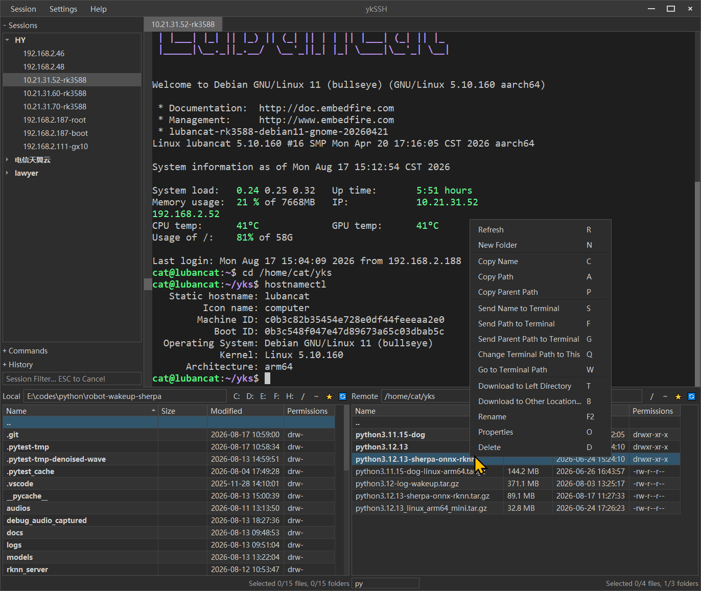

# ykSSH

ykSSH is a local desktop SSH client built with PyQt5. It provides a WindTerm-like workspace with a session tree, tabbed terminal sessions, and a dual-pane local/remote file manager backed by SFTP.

The project is currently in active development and primarily targets Windows and Linux.



## Features

- SSH session tree with folders and saved connection profiles
- Multiple terminal tabs with VT-style rendering via `pyte`
- Integrated SFTP file manager with local and remote panes
- Per-tab file panel state
- Password-based and private-key authentication
- Encrypted password storage using Fernet
- Frameless PyQt5 window
- Built-in themes: Solarized, Light, and Dark
- English and Simplified Chinese UI strings
- Persistent window, splitter, theme, font, and session settings

## Tech Stack

- Python 3.10+
- PyQt5
- asyncssh
- qasync
- pyte
- cryptography
- loguru

## Installation

ykSSH requires **Python 3.10 or newer**.

```powershell
git clone https://github.com/yinkaisheng/ykssh.git
cd ykSSH
python -m venv .venv
.\.venv\Scripts\Activate.ps1
pip install -r requirements.txt
```

## Run

```powershell
python main.py
```

ykSSH stores runtime data under `config/` and writes logs under `logs/`. These directories are intentionally ignored by Git.

## Terminal Shortcuts

| Shortcut | Action |
|---|---|
| `Ctrl+L` | Focus the current terminal when focus is elsewhere; when the terminal already has focus, send `Ctrl+L` to the remote shell to clear the screen |
| `Ctrl+Shift+C` / `Shift+Delete` | Copy selected terminal text |
| `Ctrl+Shift+V` / `Shift+Insert` | Paste |
| `Ctrl+A` / `Ctrl+E` | Move to the start/end of the current shell input line |
| `Ctrl+U` | Clear the current shell input line |
| `Ctrl+W` | Delete the word before the cursor |
| `Ctrl+R` | Search backward through shell command history |
| `Ctrl+C` | Interrupt the foreground command or cancel the current shell input |
| `Ctrl+D` | Send EOF; on an empty shell input line this commonly exits the shell |
| `Alt+Left` / `Alt+Right` | Move backward/forward by one word |
| `Alt+Backspace` / `Alt+Delete` | Delete the previous/next word |
| `Ctrl+Shift+Home` | Jump to the oldest local scrollback content |
| `Ctrl+Shift+End` | Return to the newest terminal output |
| `Ctrl+Mouse Wheel` | Fast-scroll by one visible page minus one overlapping line |
| `Ctrl+Alt+B` | Focus the remote file table for the current terminal tab, or the local file table when remote files are unavailable |
| `Ctrl+;` | Focus the local file table for the current terminal tab |
| `Ctrl+'` | Focus the remote file table for the current terminal tab |

The shell editing shortcuts are sent to the remote shell and work with common
readline, zsh, and fish configurations. Local scrollback shortcuts are only
intercepted on the terminal main screen, so alternate-screen TUI applications
such as Vim keep their normal Home/End handling. Pressing Enter while viewing
older scrollback first returns the viewport to the newest output. Other keys
which edit or navigate the remote input line—such as arrows, word movement,
Backspace/Delete, regular text, paste, and IME input—do the same before being
sent to the remote shell; local copy and scrollback shortcuts do not.

## File Panel Shortcuts

These shortcuts apply while a local or remote file table has focus unless noted otherwise.

| Shortcut | Action |
|---|---|
| Type text / `Ctrl+F` | Filter the current file list; `Esc` clears the active filter |
| `Up` / `Down` in the filter field | Select the previous/next visible result while keeping focus in the filter field |
| `Ctrl+R` | Refresh the current file list and restore selections that still exist |
| `Ctrl+N` | Create a new folder in the current directory |
| `Ctrl+D` | Open the favorites menu; press `1`–`9` or `0` to choose one of the first ten paths |
| `F2` | Rename the single selected file or folder; `Esc` cancels and `Enter` confirms |
| `F3` | Open selected files with their system-associated applications; folders are ignored |
| `F4` | Open selected files with the configured editor; falls back to system association if unavailable |
| `Enter` | Enter a single selected folder; otherwise open selected files with their system-associated applications |
| `Right` | Enter the single selected folder |
| `Left` | Go to the parent directory |
| `Ctrl+Left` | Go to the current local drive/share root or remote `/` |
| `Alt+Enter` | Show properties for the selected items |
| `Home` / `End` | Select and reveal the first/last visible row |
| `Ctrl+Up` | Focus the path field and select the entire path |
| `Ctrl+Down` | From the path field, return focus to its file table |
| `Alt+Right` | From the local table, focus the remote table |
| `Alt+Left` | From the remote table, focus the local table |
| `Delete` | Local: move to Recycle Bin; remote: confirm and delete |
| `Shift+Delete` | Permanently delete locally; delete remotely without confirmation |

## Application Shortcuts

| Shortcut | Action |
|---|---|
| `Ctrl+;` | Focus the current tab's local file table from the terminal; no action outside the terminal |
| `Ctrl+'` | Focus the current tab's remote file table from the terminal |
| `Ctrl+L` | Return focus to the current connected terminal from elsewhere in the application |
| `Ctrl+Alt+B` | From the current terminal, focus its remote file table; falls back to the local file table when disconnected |

## Configuration And Security

Session profiles are stored in `config/sessions.json`.

Passwords are not stored in `sessions.json`. They are encrypted with Fernet and written to:

- `config/credentials.json`
- `config/secret.key`

SSH server identities use trust-on-first-use (TOFU) and are stored in
`config/host_keys.json`. The first connection shows the server fingerprint for
confirmation. A later fingerprint change blocks the connection.

Private key paths may be stored in session profiles, but private key contents are not copied into the project configuration.

Do not commit files from `config/`, `logs/`, or any file containing real credentials.

## Project Layout

```text
ykSSH/
├── main.py                      # Application entry point
├── app_info.py                  # App metadata
├── log_util.py                  # Logging helpers
├── core/                        # SSH, SFTP, connection lifecycle
├── models/                      # Session and favorite path models
├── storage/                     # Config, sessions, credentials
├── ui/                          # PyQt5 widgets and dialogs
├── i18n/                        # Translation engine and fallback strings
├── Languages/                   # English and zh-CN translation files
├── AGENTS.md                    # Contributor and AI-agent guidelines
└── IMPLEMENTATION.md            # Detailed architecture notes
```

## Development Notes

- Keep the UI framework on PyQt5.
- Keep SSH and SFTP operations inside the qasync event loop.
- Add user-facing text through the i18n system instead of hard-coding strings.
- Use `SftpUiHandler` as the bridge between file-panel UI actions and SFTP operations.
- Keep runtime credentials out of source control.

For deeper architecture details, see [IMPLEMENTATION.md](IMPLEMENTATION.md).

## Validation

After making changes, run at least:

```powershell
python -c "from ui.main_window import MainWindow"
python -m compileall .
python main.py
```

Core storage and SFTP safety checks can also be run with:

```powershell
python -m unittest discover -s tests -v
```

If GUI startup is not available in your environment, run `python -m compileall .` and document the limitation.

## License

This project is licensed under the MIT License.
